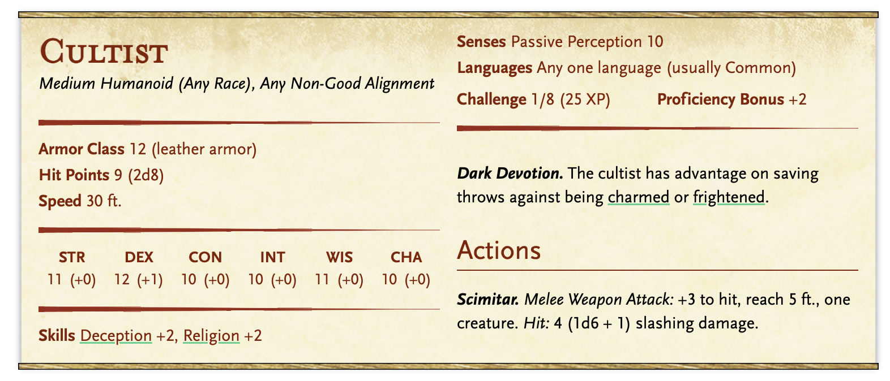
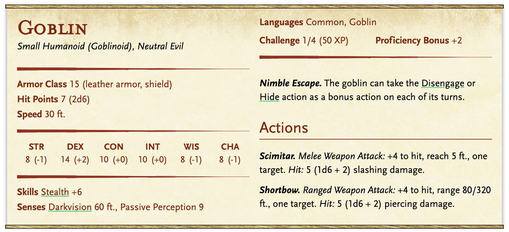
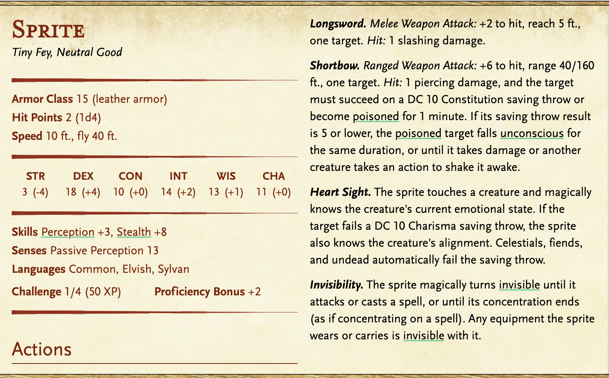

# Session 1

- [Session 1](#session-1)
  - [Summary](#summary)
  - [The Shadows of Dissent](#the-shadows-of-dissent)
    - [Summary](#summary-1)
    - [The Box](#the-box)
    - [Setting](#setting)
    - [Plot](#plot)
    - [Forest Goblin Encounter](#forest-goblin-encounter)
      - [Stats](#stats)
        - [Cultists](#cultists)
        - [Goblins](#goblins)
  - [The Wildwood Sprite Ambush](#the-wildwood-sprite-ambush)
    - [Stats](#stats-1)
      - [Sprites](#sprites)
      - [Roderic the Thief](#roderic-the-thief)


## Summary

Players meet at Tavern in Eldertop.

Explore the town - meet some interesting people.

Library to learn the history of Arventia. 

Invasion at the marketplace.

Talk with Elara - see where that goes

Overhear rumor - underground cult

Goal: Establish who they are, how they interact with the party and others, eventual motivation to leave the city (3rd level) 


## The Shadows of Dissent

### Summary

A group of hooded characters are in a corner table at the Sylvan Haven. They are studying something. They are wearing the symbol of the emblem of the Obscurans on their neck as pendants. A lone scholar, Seraphina, is investigating them and concealing in the shadows. She hears plans of them disrupting Arventian progress. They are passing a small, ornate box to the "leader" in a red hood, which she believes contains a special object, possibly of destruction. Seraphina tries to chase it and there's a chase etc. 

### The Box

The Box contains the [Shard of Dissolution](https://github.com/mspencedm/Arventia/blob/main/Items/ShardOfDissolution.md). 

The ornate box, discovered by Seraphina in the Sylvan Haven, contains a powerful magical artifact known as the "Shard of Dissolution." This mysterious and dangerous item is a crystalline shard that emanates a faint, ominous glow.

The Obscurans intended to use the Shard of Dissolution to disrupt the harmony of Arventia, causing chaos and erasing the technological and magical advancements that the Arcknights have worked so hard to maintain. The box was meant to transport and conceal the dangerous artifact as it made its way into the hands of those willing to enact the Obscurans' dark plan.


### Setting
The Sylvan Haven, a bustling tavern nestled within the heart of Eldertop, the City of Celestial Tears.

### Plot
As the sun dips below the horizon and Eldertop's floating cityscape takes on an otherworldly glow, the Sylvan Haven comes to life. The tavern is known for being a sanctuary for scholars, adventurers, and those with a thirst for knowledge, but tonight, a sinister undercurrent lurks beneath its lively exterior.

Scene 1: A Bustling Night at the Sylvan Haven

The Sylvan Haven is abuzz with activity, its wooden beams, and cozy atmosphere filled with merriment. Adventurers and Arventian citizens gather to share stories, music, and the latest discoveries. The gentle melodies of a bard's lute accompany lively conversation.

Scene 2: A Shadowy Encounter

In the dimly lit corner of the tavern, a group of individuals clad in dark, hooded robes huddle around a table. Their presence is inconspicuous, and they appear to be studying something intently. A furtive glance reveals their symbol—the emblem of the Obscurans. The broken chain, serrated blades, and thorny vines are worn around their necks on pendants.

Scene 3: A Mysterious Transaction

As patrons celebrate, a lone scholar, Seraphina, intrigued by the secretive gathering, decides to investigate. Concealing herself in the shadows, she overhears whispers of a plan to disrupt Arventian progress. The Obscurans are passing a small, ornate box with the Obscuran symbol on it around to the "leader" in a red hood. The box, she deduces, contains an object of potential destruction.

Scene 4: Confrontation and Escape

With the Obscurans' intentions becoming clearer, Seraphina realizes she must act. Silently, she approaches their table, revealing her presence. An uneasy silence falls over the group, but before they can react, she snatches the ornate box. Chaos ensues as the Obscurans attempt to seize it back.

Scene 5: Pursuit and Uncertainty

Seraphina dashes through the tavern, the box clutched tightly in her grasp. The Obscurans give chase, their identities concealed beneath their dark hoods. In the maze of tables and patrons, it's a high-stakes game of cat and mouse.

Scene 6: A Narrow Escape

The chase leads Seraphina into the forest while the Obscurans are still in pursuit. 

### Forest Goblin Encounter

On the chase, Seraphina is clutching the box. Goblins from the forest hidden in the trees appear and the cultists are behind her. She is surrounded. 

3 Goblins

- [ ] Goblin 1


- [ ] Goblin 2


- [ ] Goblin 3


4 Cultists

- [ ] Cultist 1


- [ ] Cultist 2


- [ ] Cultist 3


- [ ] Cultist 4


#### Stats

[Seraphina](https://github.com/mspencedm/Arventia/blob/main/NPCs/Seraphina.md)

##### [Cultists](https://www.dndbeyond.com/monsters/16835-cultist)



##### [Goblins](https://www.dndbeyond.com/monsters/16907-goblin)




Scene 7: Hidden Truths

Finally, Seraphina finds refuge in a dimly lit chamber beneath the tavern, clutching the ornate box. Her curiosity drives her to open it, revealing an artifact of dark power. The box contains a hidden message—an encrypted plan of destruction devised by the Obscurans.

The message is encrypted and says
```
Sri sygsi lewx erhii gsqirxmrk. Aiiii xsqex xsrriw srhiri syxw
```

When decrypted, it says
```
One piece has been collected. We will restore order
```

Steps for solve:


Conclusion: A Gathering Storm

Seraphina leaves the tavern, carrying the ominous message with her, aware of the growing threat of the Obscurans. As she steps out into the luminous Eldertop night, she knows that the balance of power in this city of knowledge and innovation is hanging in the balance. The Obscurans, with their sinister goals, are ready to strike, and the Sylvan Haven may soon be at the center of a storm that threatens the very heart of Eldertop.

## The Wildwood Sprite Ambush

The Leafy Larcenists 
sprites - attempting to steal from the market 
one human there trying to steal stuff

Crowds gather and merchants are angry and trying to protect their things. 
Thief name: Roderic
Using agility to evade players, steal items, and use the chaos to his advantage. 
Any shop that doesn’t get robbed will be friendlier to the players and provide a discount. Shops that got robbed will be more hostile after.

When the players start to get desperate/combat draws on → Elara - powerful local hero - saves the day and will help the players wrap-up the encounter.

### Stats

#### [Sprites](https://www.dndbeyond.com/monsters/17020-sprite)
15 sprites - Stats - fight as hoards of 5 (do like combo on stats to make it simpler - basically beefing up the sprites - hoards only attack once)

- [ ] Sprite Hoard 1


- [ ] Sprite Hoard 2


- [ ] Sprite Hoard 3


- [ ] Sprite Hoard 4


- [ ] Spriate Hoard 5




#### Roderic the Thief
Human Rogue
AC: 13
HP: 18
Str: 10 (0) | Dex: 16 (+3) | Con: 10 (0) | Int: 12 (+1) | Wis: 14 (+2) | Cha: 10 (0)
Acrobats +5 | Stealth +5 | Sleight of Hand +5 | Perception +4 | Passive Perception: 14

Evasion: Dex sav half damage - no damage

Nimble Escape: Disengage/Hide action as a bonus action

Sneak Attack: Extra 3d6 when hit target with weapon attack and has advantage or ally within 5 feet of target and he doesn’t have disadvantage

Actions:

Shortsword: +5 melee, 5ft. Hit: 1d6+3 piercing
Shortbow: +5 ranged, 80/320 HIt: 1d6 + 3 piercing

Multiattack - Roderic makes two attacks

Bonus Actions: 

Cunning Action: bonus action to dash, disengage, hide

React:

Uncanny Dodge: Roderic can see attacker - reaction to half attack damage

