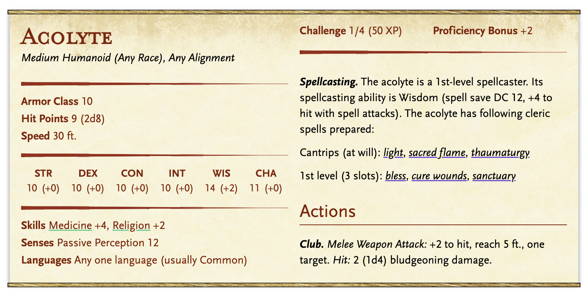
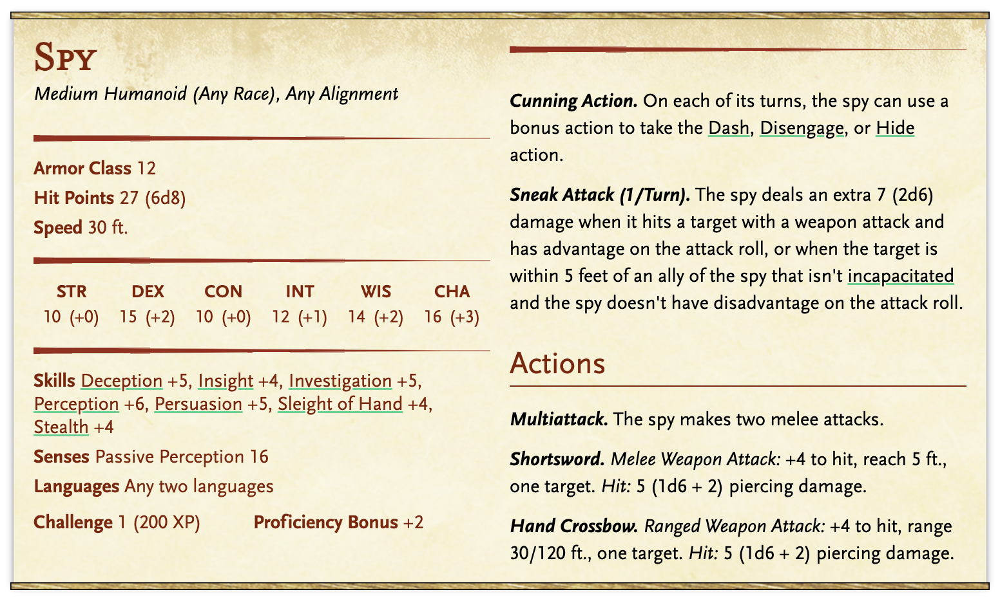
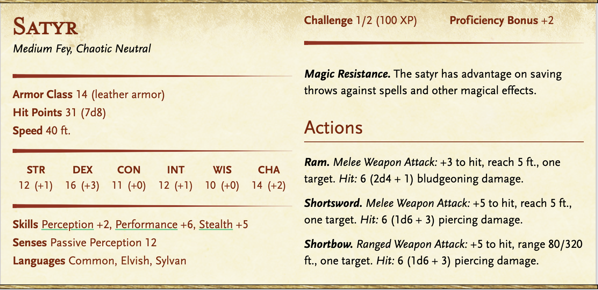
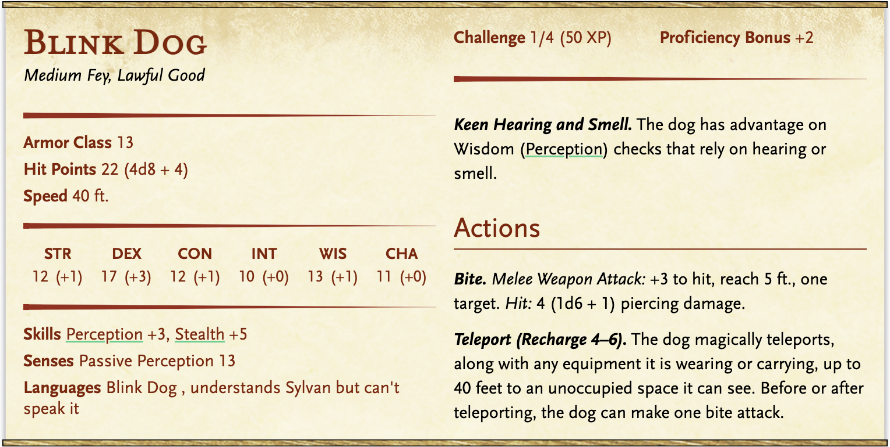

# Session 2

- [Session 2](#session-2)
  - [Summary](#summary)
  - [The Ludon Hearth Revelation](#the-ludon-hearth-revelation)
  - [The Enigma of Seraphina](#the-enigma-of-seraphina)
  - [A Journey to the Docks](#a-journey-to-the-docks)
  - [Encounter - Rival Temples Clash](#encounter---rival-temples-clash)
    - [Stats](#stats)
      - [Acolyte](#acolyte)
      - [Spy](#spy)
  - [Revelations and Shadows](#revelations-and-shadows)
  - [Turned Away at the Docks](#turned-away-at-the-docks)
  - [The Hidden Portal Between Planes](#the-hidden-portal-between-planes)
  - [Encounter - Creatures from the Feywild](#encounter---creatures-from-the-feywild)
    - [Stats](#stats-1)
      - [Satyr](#satyr)
      - [Blink Dog](#blink-dog)
  - [The Second Shattering](#the-second-shattering)
  - [New Places We Shall Go](#new-places-we-shall-go)

## Summary

Seraphina has the Shard of Dissolution in the box and ran away. 

The players receive a message in the tavern from an anonymous person that tells them to meet at the Lud Hearth.

## The Ludon Hearth Revelation

As the party steps into The Lud Hearth, expecting to meet Seraphina, they are met with a surprising twist. Instead of the elusive figure, they are welcomed by a charming and eccentric priest of Ludon named Tharivol Silver. With a twinkle in his eye, Tharivol invites them to witness Ludon's mysteries in the back of the tavern.

Entering a hidden alcove, the party discovers the Ludon altar. Tharivol, with a flourish of his hands, conjures illusions above the altar—a captivating display that tells tales of Eldertop's history, Ludon's legendary pranks, and snippets of arcane knowledge. Intrigued, the party asks about Seraphina.

## The Enigma of Seraphina

Tharivol's expression shifts from playful to concerned as the party inquires about Seraphina. The illusionary images waver, revealing a shadowy figure resembling Seraphina. Tharivol explains that she's an acolyte who stole the Shard of Dissolution for the temple of Ludon but has not sent word back.

With a somber gaze, Tharivol uses his magical connection to seek Seraphina. A distant, ethereal echo is heard, suggesting she's on another plane, her presence flickering like a candle in the wind. Tharivol expresses worry, suspecting something might have gone awry.

## A Journey to the Docks

Tharivol implores the party for assistance, revealing that the Ludon temple hasn't heard from Seraphina since she undertook the task. He requests the party to visit the docks, where rumors suggest she might have been seen last.

As the party heads to the docks, they find the atmosphere tense. A group of unruly figures, aligned with a rival temple, confronts them, demanding answers. A combat encounter ensues as the party defends themselves, and the foes reveal knowledge of Seraphina's activities.

## Encounter - Rival Temples Clash

Adversaries: Members of a rival temple dedicated to the god of night, Umbrus deity.

Setting: The docks at dusk, with crates and barrels providing cover.

Objectives: Defend against the attackers and gather information about Seraphina's recent whereabouts.

Twist: The rival temple members have their own reasons for seeking Seraphina, and their deity's motivations might clash with Ludon's.

2 Acolytes

- [ ] Acolyte 1
- [ ] Acolyte 2

1 Spy

- [ ] Spy 1

### Stats

#### [Acolyte](https://www.dndbeyond.com/monsters/16763-acolyte)

#### [Spy](https://www.dndbeyond.com/monsters/17021-spy)

## Revelations and Shadows

After the skirmish, (last person standing will surrender) the party interrogates the defeated temple members, learning that Seraphina was last seen near an ancient portal on the outskirts of Eldertop. The portal is rumored to connect to a realm touched by trickster magic.

With newfound information, the party faces a choice: to delve into the mysteries beyond the portal and unravel the enigma of Seraphina or to return to the Ludon temple with the gathered information.

## Turned Away at the Docks

The players are rejected by the guards at the dock. This is because when the shattering occurs there is going to be a violent break of the planes and Lirael wants to protect his daughter and keep her away. 

The changeling is going to be pretending to be one of the guards who is insistent that they must turn back.

If they go back to the Lud Hearth, Tharivol will inform him that there is a secret planar portal hidden in Eldertop in the basement of the Sylvan Haven. The rumor goes that in the backroom behind the barkeep there is a secret door passage way that spirals down to a secret portal connecting to the Feywild that was used by the Arcknights as a secret means of transportation so they could go between planes secretly and easily. Now, however, it was used to avoid taxes and tarriffs transporting between planes that are currently present; hence, they are illegal. However, it is rumored that most cities have some hidden planar portals within different taverns or notable places for this purpose.  

If they go back to the Sylvan Haven, the bard will tell them a similar rumor. The library will also hold someone who will tell them this. 

## The Hidden Portal Between Planes

See Eldertop -> Sylvan Haven --> Hidden Portal

As the players talk to the guardian of the portal, before they can enter or do anything, the second shattering is going to occur. The portal will shatter, and as this occurs, creatures from the Feywild will seep through and enter the area. They will be hostile beasts that attack the players.

## Encounter - Creatures from the Feywild

1 Satyr

- [ ] Satyr 1

3 Blink Dog

- [ ] Blink Dog 1
- [ ] Blink Dog 2
- [ ] Blink Dog 3

### Stats

#### [Satyr](https://www.dndbeyond.com/monsters/17005-satyr)

#### [Blink Dog](https://www.dndbeyond.com/monsters/16809-blink-dog)

## The Second Shattering

Ground will shake and people are going to freak out - then dealing with the aftermath. 

Players are going to be called in by Lirael Nightbloom. Because he knows the city is soon going to be in even worse shape, and because he wants to protect his daughter, he will send her away to a nearby city. Guards will be looking for her around the town so they will make their way there eventually.

## New Places We Shall Go

After staying the night to rest, Lirael will urge the party to travel to a nearby city for protection as he does not beleive Eldertop will be safe any longer. Because of how large Eldertop is, I'm going to make the surrounding villages small. 

Player Choice:

Travel East across the ocean to a city called Aurora's Heart. Another bustelining port city sitting on the water. Also quite a large city, metropolitan. 7 day journey

Travel South through or around a mountian pass to a city called Stonehaven. This is a medium sized city that is also on the water. Potentially 7 day journey but mountain pass

Travel West through an open field to a smaller but beautiful city called Windsong Valley. This is a medium size city that's in the middle of the plain that's less bustelining and more of a community. 5 day journey.

Travel North to the colder city of Glacialheim. This is a smaller more villagelike community that's more in snowier conditions. This is about a 7 day journey on foot that will require players to climb a mountain. 

